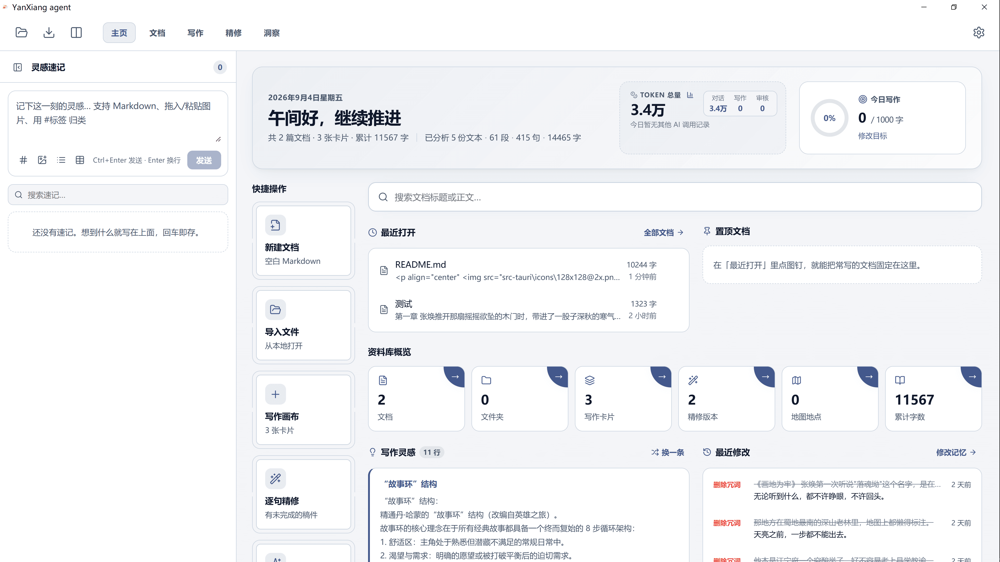
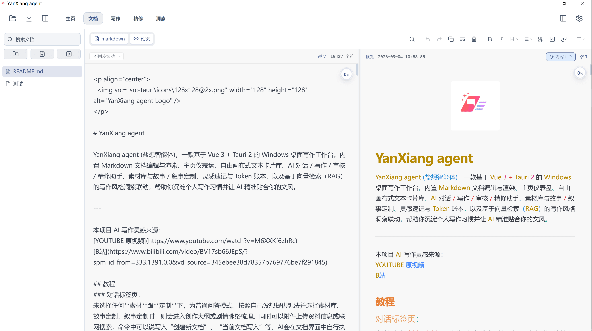
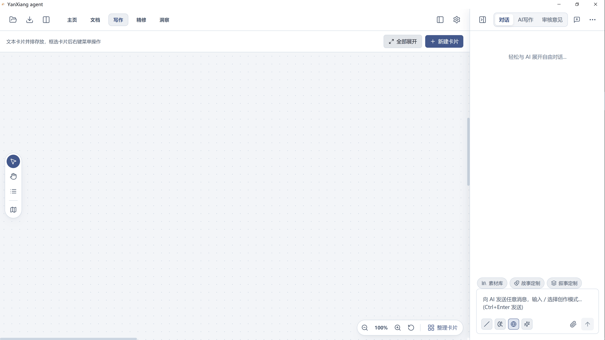

<p align="center">
  
</p>

# YanXiang agent

YanXiang agent (盐想智能体)，一款基于 Vue 3 + Tauri 2 的 Windows 桌面写作工作台。内置 Markdown 文档编辑与渲染、主页仪表盘、自由画布式文本卡片库、AI 对话 / 写作 / 审核 / 精修助手、素材库与故事 / 叙事定制、灵感速记与 Token 账本，以及基于向量检索（RAG）的写作风格洞察联动，帮助你沉淀个人写作习惯并让 AI 精准贴合你的文风。

---

本项目 AI 写作灵感来源：
[YOUTUBE 原视频](https://www.youtube.com/watch?v=M6XXKf6zhRc)
[B站](https://www.bilibili.com/video/BV17sb66JEpS/?spm_id_from=333.1391.0.0&vd_source=345ebee38d78357b769776be7f291845)

## 教程
### 对话标签页：
未选择任何**素材**跟**定制**下，为普通问答模式。按照自己设想提供想法并选择素材库、故事定制、叙事定制时，则会进入创作大纲或剧情脉络梳理。同时可以附件上传资料信息或联网搜索，命令中可以说“创建新文档”、“当前文档写入”等，AI会在文档界面中自行执行；而写作画布界面可以换成“新建文本卡片”等对应词汇。
### 写作标签页：
- 先前往 [Notebook](https://notebook.google/) 登录谷歌账号，使用 **src\prompts\md\写作风格画像.md** 里的提示词完成自己文章的写作风格提取，之后在**AI写作**中以**附件**形式加载写作风格文档，在输入框中填写内容要求一并发送即可。
- AI写作按照写作风格输出正文后，把正文拖拽或点击“应用到画布”中形成文本卡片，右键菜单选**智能体——添加到输入框**，将正文文本卡片添加到输入框后，切换到**审核意见**标签页，直接发送。
- “审核意见”输出内容后，重新形成新的文本卡片，按步骤右键菜单把从“审核意见”获得的文本卡片添加到输入框，回到**AI写作**标签页，点击发送，这个时候AI写作就会自己按照“审核意见”进行二次修改。
- 上述步骤可重复数次，直到满意。




---

## 目录

- [技术栈](#技术栈)
- [核心功能](#核心功能)
- [项目结构](#项目结构)
- [模块关联与数据流](#模块关联与数据流)
- [数据持久化](#数据持久化)
- [向量检索（RAG）机制](#向量检索rag机制)
- [快捷键一览](#快捷键一览)
- [开发指南](#开发指南)
- [隐私说明](#隐私说明)

---

## 技术栈

| 层次 | 技术 |
| ---- | ---- |
| 前端框架 | Vue 3 (Composition API, `<script setup>`) + TypeScript |
| 构建工具 | Vite 5 + vue-tsc |
| 桌面框架 | Tauri 2（Rust / WebView2） |
| Markdown | marked + highlight.js |
| 图标 | lucide-vue-next |
| 数据存储 | localStorage（浏览器预览）/ Rust + SQLite（Tauri 桌面） |

---

## 核心功能

### 0. 主页（Home 仪表盘）
- 顶部导航第一个标签页（`HomeView.vue`），聚合常用入口与真实数据：问候语 + 今日目标进度、快捷操作（新建 / 导入 / 卡片 / 精修）、最近打开、置顶文档、资料库概览、快速搜索、写作灵感、最近修改、Token HUD。
- 后台由 `homeStore.ts` 维护（置顶 / 最近打开 / 今日目标），启动时随 `bootHomeStore()` 恢复。

### 1. 文档（Markdown 编辑器）
- 支持**分屏（编辑 + 预览）**、**纯编辑**、**纯预览**三种模式；分栏视图支持同屏编辑两篇文档（左右双编辑器）。
- **多文档文件树**：左侧 `DocumentSidebar` 管理多个 `.md` 文件与文件夹（新建 / 重命名 / 分组 / 删除），当前文档内容自动持久化。
- 常用格式工具栏：加粗、斜体、标题（下拉可选 H1–H5）、列表（下拉可选无序 / 有序）、引用、代码块、链接、查找/替换（高亮定位）。
  - 行级语法（标题 / 列表 / 引用）先剥离该行已有标记再套上新标记，不会叠成 `## ## 标题`；再点同一档即取消，跨行选中时逐行套用、有序列表自动重排序号。
  - **撤销 / 重做覆盖工具栏与 AI 改写**：编辑器自建快照历史栈（不再依赖 `document.execCommand`），工具栏插入的 markdown 语法、查找替换、一键排版、清空、AI 润色 / 续写 / 行内编辑一律可用 `Ctrl+Z` 撤回、`Ctrl+Shift+Z` / `Ctrl+Y` 重做；连续键入按停顿与段落自动并成一步，切换文档时历史清零。
- **选中文字浮现工具栏**：选中文字后光标旁浮现 剪切 / 复制 / 粘贴 / 全选 / 删除 快捷条，水平跟随光标、垂直自动翻转避让屏幕四边。
  - 点「⋮」展开 **更多文本处理菜单**（菜单出现时工具栏暂时隐藏，返回箭头恢复）：**智能交换**（中文 / 英文整词 / 数字 / 标点按相邻两类两两互换）、**英文大小写**（全大写 ⇄ 小写）、**首字母大小写**（每词首字母大 ⇄ 小写）、**智能引号**（半角直引号替换为成对弯引号）。
  - 处理过程中选中文字始终保持选中；点击空白、切换选区或超时无操作自动消失。
  - 可在「设置 → 配置」中一键关闭整个浮现工具栏（默认开启）。
- **阅读辅助（进度条 / 圆环 / 章节目录）**：编辑区与预览区顶部各有细条**阅读进度条**；各区右上角有一枚**阅读进度圆环**（`ReadingProgressRing.vue`），实时显示相对阅读位置，可长按拖拽摆放，悬停展开**章节目录**（按标题解析，`readingOutline.ts`）点击跳转；圆环的开关 / 大小 / 不透明度 / 摆放位置（`readingRingStore.ts`）随设置持久化，各界面位点（主文档 / 分栏 / 画布卡片 / 拼文弹窗）独立记忆。
- **滚动同步**：编辑区底部窄面板左侧可切换「同步滚动 / 不同步滚动」——同步时编辑区与预览区按各自内容高度比例联动滚动。
- **禅定专注模式**：由阅读圆环触发进入纯 Markdown 或纯预览的全屏沉浸态，左下角胶囊 / `Esc` 退出，专注期间退出直达原文位置。
- **聚光高亮**：专注模式下可开启“聚光”，仅高亮光标所在行（强度 / 模糊可调），弱化其余文字，降低视觉噪声。
- **修订与批注**：选中文字右键「修订与批注」（或 `Ctrl+Shift+M`，`RevisionAnnotation.vue`）可给片段挂一条修订或批注记录；图层以**二级目录**折叠在左侧文件树的文档条目下（`RevisionLayerList.vue`，数据在 `revisionStore.ts`），支持小眼睛预览开关、逐条应用 / 拒绝、定位；预览区按“小眼睛”开启的图层**合成展示**修订后内容，原文本身不被改写。
- **Ctrl+K 行内 AI 编辑**：光标处或选中文字后按 `Ctrl+K` 唤起行内改写浮层（`InlineAiEdit.vue`），按你的写作习惯重写该片段，`Ctrl+Enter` 采纳 / `Esc` 取消，改动计入编辑器撤销历史；采纳的改写会进入「修改记忆」（洞察）。
- **文档条目 AI 改动指示**：AI 正在改写某篇文档时，左侧文件树对应条目标出循环边框动效（`aiDocActivity.ts`），一眼看出是哪篇在被 AI 动。
- 顶部“导入文件”按钮支持导入 `.txt` / `.md` / `.markdown` 文件。

### 2. 写作（画布模式）
- **自由画布**：文本卡片以绝对坐标放置在无限画布上（`LibraryView.vue`）。
- **拖拽与持久化**：选择模式下按住卡片可自由拖动，位置（`x` / `y`）变更后自动持久化记忆，刷新/重启后保持原布局。
  - 支持框选、Ctrl/⌘ 多选；多选后拖拽可整体移动并保持相对位置。
- **移动画布**：手抓工具，或按住 `空格` + 左键拖拽。
- **滚轮缩放**：按住 `Alt` + 滚轮 以选中卡片中心（未选中则以鼠标指针为中心）缩放画布；未按 `Alt` 时为普通滚动浏览；底部有缩放控制台（缩小 / 百分比 / 放大 / 重置）。
- **打组机制（参考 Blender / ComfyUI Node）**：
  - 多选卡片后按 `Ctrl+G` 或右键菜单“打组 (Ctrl+G)”打组；`Ctrl+Shift+G` 或右键“取消打组”解散。
  - 展开时打组卡片被包裹进一个**半透明组面板**，可拖拽标题栏整体移动、内联改名。
  - 折叠后变成**文件夹卡片外观**，显示组名 / 卡片数量 / 收纳卡片预览；点击展开按钮或双击文件夹即可展开。
  - 卡片列表面板中打组卡片自动归纳进**可折叠文件夹**，未分组卡片单列展示。
  - **折叠/展开状态持久化**：画布上的「文件夹 ⇄ 组面板」形态、卡片列表里文件夹的展开折叠，重启/刷新后原样恢复。
- **卡片列表快速定位**：在左下列表面板点击某张卡片，画布会自动平移到该卡片并选中；点击文件夹则平移到对应打组中心。卡片被移到屏幕外也一找即达；若目标卡片所在组处于画布折叠态，会先展开再定位。
- **卡片编辑面板**：双击卡片正文或点「编辑」打开独立编辑浮窗（内含标题、色条颜色、置顶、正文编辑），标题旁的**颜色圆点与置顶按钮集中在关闭按钮左侧**；关闭后改动即时落库。
- AI 回复支持拖拽到画布生成文本卡片（`cardEvents` 内部事件桥接）。
- **地图（故事地图）**：画布工具栏可打开 `MapView`，自由手绘路径、沿路径标注地点（图钉/信件/旗标等），把写作卡片**附着到地图地点**，从地图点击地点即可跳回画布定位对应卡片，用于搭建世界观与角色动线。
- **拼文（卡片拼接）**：选中多张卡片（或全选）后按 `Ctrl+Shift+P` 预览拼接 / `Ctrl+Shift+C` 对比拼接（`CardStitchModal.vue`），把多卡内容合并为一篇完整文稿；对比模式支持左右双编辑器逐卡比对编辑、撤销 / 重做，并可将结果「保存到卡片 / 放入文档 / 下载」。

### 3. 精修
- 内置 **“人类化干预”** 精修提示词（`refineAgent.ts`）：通过打破 AI 文本高流畅度、人工提升困惑度、控制改写粒度（20%-30%关键词）、拥抱人类句式节奏（短句、代词复指、破折号括号补充、口语化衔接）等方式，让改写文本具备高多样性与节奏感、真实“人味”，并规避高频套话。
- 对输入的文稿按句子**并行分组调用大模型加工**（每组附带前后 2 句上下文），进度与统计实时展示；支持 OpenAI / OpenAI 兼容 / DeepSeek / Anthropic。
- 生成版本历史（`refineStore.historyVersions`），保留原稿与精修稿对照。

### 4. 洞察
- 分析并沉淀用户写作习惯（`insightStore`）：
  - 遣词造句偏好 / 段落结构偏好 / 修改倾向（回避表达）。
  - 历史修改范例、词频画像、风格仪表盘、画像标签。
- 为 AI 写作、精修提供风格上下文与风格样本。

### 5. 向量数据（RAG）
- 设置面板 **“向量数据”** 选项卡（位于“精修”下方）：
  - **总开关**：“向量模型”开关，一键启用 / 停用向量的 RAG 联动。
  - 模型来源切换：**内置本地模型** / **远程 API**。
  - 内置模型：`all-MiniLM-L6-v2`、`BGE Small EN v1.5`、`BGE Small ZH v1.5`（默认启用）、`Multilingual E5 Small`，支持下载 / 清除 / 启用开关，展示维度与体积。
  - 远程 API：配置 Embedding Endpoint、API Key、模型名。
  - **导入 / 导出向量化配置**：状态卡片下方可一键将向量模型选择、启用状态与远程 API 配置导出为 JSON，或从 JSON 导入并自动重建索引。
- 将洞察数据（习惯、范例、卡片样本）**向量化建索引**（`vectorStore.ts`），在 AI 请求时按当前问题做**语义检索 Top-K**，只注入相关片段，避免 Token 损耗过大与 AI 读取不准。

### 6. AI 侧边栏（对话 / 写作 / 审核）
- 独立侧边栏，与顶部导航平齐；包含 **对话（自由聊天）**、**AI 写作**、**审核员** 三个会话空间（`ChatSidebar.vue`）。
- 支持新建对话、对话历史切换与删除、消息重编、复制、转存卡片、导出对话记录（`yanxiang_chat_records_*.json`）。
- 写作 / 审核两个会话空间独立模型（`model` / `auditorModel`），写作侧自动调用 `buildRAGInsightContext` 将相关的洞察检索结果注入系统提示词。
- **智能体工具**（`agentRunner.ts` + `knowledgeTools.ts` + `cardTools.ts` + `webSearch.ts`）：模型可真实调用工具——读取/检索知识文件（`list_knowledge` / `read_knowledge` / `search_knowledge`）、操作画布卡片（`list_cards` / `read_card` / `create_card` / `update_card`）、联网搜索（`web_search`，无需 API Key）。同一消息支持多轮工具调用直到给出最终答复。
- **素材库（材料库）**：对话面板内置常见写作方法论素材（三番四抖、五线写作原则、倒推五线手法、韩式思维、英雄之旅、27 章结构法等，见 `materialStore.ts`），可勾选复用、自定义增删改，并作为后台上下文随消息携带。
- **故事定制**（`storyStore.ts`）：仅「对话」页有效，点选**角色原型**（导师 / 信使 / 阴影 / 欺诈者…）与**情节**（底层逆袭 / 探求 / 远行与回归…），注入系统提示词作为人物功能位与情节骨架；不选时完全走原流程。
- **叙事定制**（`narrativeStore.ts`）：「对话」与「AI 写作」页有效，点选**叙事结构 / 叙事手法 / 结局结尾**（共 25 项，见 `NARRATIVE_*`），逐章轮换取用以打散同构写法；未勾选即不注入任何指令。
  - 定制项以**不可编辑胶囊**渲染在输入框内（`narrativeChips` / `storyChips`），展示于用户气泡，仅为界面装饰；指令本体走系统提示词，不进入正文，复制 / 拖拽生成卡片时不会带上。
  - 素材库、故事定制、叙事定制三个功能均可在「设置 → 配置」中**全局关闭**（默认开启）。

### 7. 灵感速记
- 主页侧栏的 `InspirationPanel.vue`：随时速记灵感（支持 Markdown、图片、`#标签`），支持搜索 / 筛选 / 置顶 / 编辑删除，最多可在卡片上「应用」到文档或 AI 输入框。
- 数据逐条持久化到本机（`db_save_inspiration_note` / localStorage `docintel:db:inspirationNotes`）。

### 8. Token 账本
- `tokenStore.ts` 全局记录各 AI 会话（对话 / 写作 / 审核）的 Token 消耗与费用估算，主页「Token HUD」（`HomeView.vue`）实时展示，随 `updatedAt` 变化落盘。

### 9. 设置面板
- **AI 接口设置**：提供商（OpenAI / Anthropic / DeepSeek / OpenAI 兼容中转）、API key、URL、模型、获取模型、测试连接、保存配置。可保存多张「提供商卡片」并在卡片间一键切换。
- **配置**：主题色（预设色板 / 自定义吸色）、字体选择（内置预设 + 本地系统字体自动检测，随文档工具栏字体下拉联动）、**行首缩进 / 首字下沉 开关**（默认关闭，与文档工具栏「排版与字体面板」中的图标开关同步）、**选中文字浮现工具栏开关**（默认开启）、**阅读进度圆环开关 / 大小 / 不透明度**（`readingRingEnabled` 等，随位置一起记忆）、**修订与批注开关**（默认开启，关闭后右键菜单 / 快捷键 / 编辑区着色一并停用），以及**素材库 / 故事定制 / 叙事定制**三个功能的全局开关（默认开启，关闭后对应按钮 / 面板 / 提示词注入一并停用）。
- **快捷键**：以「分组 + 名称 / 快捷键」表单展示项目涉及的全部快捷键（详见下文[快捷键一览](#快捷键一览)）。
- **AI 写作 / 审核员 / 精修**：各环节提示词编辑 + 知识文件（.txt/.md/.pdf/.docx）导入管理（知识以“文件清单 + 按需读取工具”形式供给模型，避免全量塞入提示词）。
- **向量数据**：见上文第 5 节。
- **关于**：项目简略说明 + 作者（Idun）与 GitHub 主页链接。

---

## 项目结构

```text
.
├── index.html                       # Vite 入口，应用标题 "YanXiang agent"
├── package.json                     # 前端依赖与脚本
├── vite.config.ts
├── tsconfig.json
└── src/
    ├── main.ts                      # 应用启动入口（初始化持久化 + 挂载根组件）
    ├── App.vue                      # 根布局：TopAppBar + 主面板 + ChatSidebar + 设置面板
    ├── style.css                    # 全局设计变量（主题/字体）、基础样式与 Markdown 样式
    ├── markdown.ts                  # marked + highlight.js 渲染配置
    ├── settings.ts                  # 应用设置状态（AI 接口 / 主题 / 字体 / 向量 / 浮现工具栏 / 三大功能开关）
    ├── docStore.ts                  # 当前 Markdown 文档的响应式状态
    ├── documentFilesStore.ts        # 多文档文件树（文件夹 + .md 文件 + 分栏双编辑器槽位）
    ├── libraryStore.ts              # 文本卡片 + 分组结构（WritingCard / CardGroup）
    ├── mapStore.ts                  # 故事地图状态（路径 / 地点 / 路径分组 + 几何工具）
    ├── materialStore.ts             # 素材库（对话侧默认写作方法论 + 自定义增删改）
    ├── storyStore.ts                # 故事定制（角色原型 / 情节 勾选与提示词注入，仅对话页）
    ├── narrativeStore.ts            # 叙事定制（结构 / 手法 / 结尾 勾选与提示词注入，对话 / AI写作）
    ├── insightStore.ts              # 洞察分析数据（习惯、历史、画像、建议）与上下文构建
    ├── insightAnalysis.ts           # 真实写作习惯分析器（语料聚合 → 习惯/画像/词频）
    ├── refineStore.ts               # 精修过程状态与版本历史
    ├── vectorStore.ts               # 洞察数据向量化索引 + 余弦相似度 RAG 检索
    ├── inspirationStore.ts          # 灵感速记状态（速记 + 标签 + 图片 + 置顶 + 应用）
    ├── homeStore.ts                 # 主页仪表盘状态（置顶 / 最近打开 / 今日目标 / Token HUD）
    ├── tokenStore.ts                # 全局 Token 账本（对话 / 写作 / 审核 消耗与费用）
    ├── knowledgeTools.ts            # 知识文件 Agent 工具（list/read/search_knowledge）
    ├── cardTools.ts                 # 画布卡片 Agent 工具（list/read/create/update_card）
    ├── webSearch.ts                 # 联网搜索 Agent 工具（无需 Key 的 Bing 文本代理）
    ├── agentRunner.ts               # 协议无关的工具调用 Agent 循环（四协议 × 流式/单发）
    ├── persistence.ts               # 持久化门面：Tauri(SQLite) / localStorage 双后端
    ├── persistenceBootstrap.ts      # 启动时恢复数据 + 自动保存 watcher 装配
    ├── readingOutline.ts            # 章节大纲解析（标题 → 目录 / 进度定位）
    ├── readingRingStore.ts          # 阅读进度圆环的位置记忆（各界面位点独立）
    ├── revisionStore.ts             # 修订与批注图层（创建 / 可见性 / 持久化 / 定位）
    ├── readingPositionStore.ts      # 阅读位置记忆（各文档 / 分栏独立，恢复上一次阅读进度）
    ├── aiDocActivity.ts             # AI 正在改动的文档条目高亮标记
    ├── cardEvents.ts                # 侧边栏 ↔ 画布 的跨组件事件总线（建卡/新对话/长按拖拽）
    ├── typewriterScroll.ts          # 打字机滚动（末尾跑道 + 光标舒适带，编辑区/预览/拼文共用）
    ├── contentColoring.ts           # 内容上色方案（标题/粗体/引用/标点等配色，预览区与手机模拟预览）
    ├── autoPairPunctuation.ts       # 输入法符号自动配对（引号/括号 v-auto-pair 指令）
    ├── chatSlashCommands.ts         # 侧边栏输入框「/」斜杠命令（新建文档 / 当前文档写入等）
    ├── docEditorDrop.ts             # 拖入 AI 回复 / 文件到编辑区的落点处理
    ├── docTools.ts                  # 文档级工具函数（文档/分栏读写、文件树定位）
    ├── refineText.ts                # 精修文本分组分句处理（并行改写粒度与上下文）
    ├── refinePunctuation.ts         # 精修 punctuation（智能引号 / 全角半角清洗）
    ├── attachments.ts               # 卡片附件 + 文件附件（添加到 AI 输入框）状态
    ├── longPressDrag.ts             # 长按拖拽原语（按住拖拽 vs 松手即选的文本选择冲突解决）
    ├── download.ts                  # 文件导入/导出/备份的 File System Access 封装
    ├── fonts.ts                     # 本地系统字体发现（设置面板与文档工具栏共享）
    ├── tauri-globals.d.ts           # Tauri 环境类型声明
    ├── vite-env.d.ts                # Vite 客户端类型声明
    ├── prompts/
    │   ├── writerAgent.ts           # AI 写作智能体名称与系统提示词
    │   ├── auditorAgent.ts          # AI 审核员名称与系统提示词
    │   ├── chatAgent.ts             # AI 对话（自由问答）智能体名称与系统提示词
    │   ├── refineAgent.ts           # 精修（人类化干预）提示词
    │   ├── knowledgeDefaults.ts     # 内置默认知识素材清单（md 打包进构建产物）
    │   └── md/                      # 随包发布的知识文档（禁止模式 / 反面例子 / 受众画像等）
    └── components/
        ├── TopAppBar.vue            # 顶部应用栏：导入/备份/导航标签/设置入口
        ├── HomeView.vue             # 主页仪表盘（快捷操作 / 最近打开 / 写作灵感 / Token HUD）
        ├── InspirationPanel.vue     # 灵感速记面板（速记 / 标签 / 图片 / 应用）
        ├── DocumentViewer.vue       # Markdown 编辑器/预览组件（含分屏、查找替换、撤销重做历史栈、行级语法下拉菜单、选中浮现工具栏 + 更多菜单）
        ├── DocumentSidebar.vue      # 文档文件树侧边栏（多文件/文件夹管理；含修订图层二级目录）
        ├── ReadingProgressRing.vue  # 阅读进度圆环 + 章节目录跳转（拖拽摆放、禅定/聚光触发）
        ├── InlineAiEdit.vue         # Ctrl+K 行内 AI 改写浮层（改写选中片段，Ctrl+Enter 采纳）
        ├── RevisionAnnotation.vue   # 修订与批注表单（右键 / Ctrl+Shift+M 唤起）
        ├── RevisionLayerList.vue    # 文档条目的修订图层列表（小眼睛/应用/拒绝/定位）
        ├── LibraryView.vue          # 写作画布：卡片拖拽、打组、缩放、卡片列表、卡片编辑面板
        ├── MapView.vue              # 故事地图：手绘路径、地点标记、卡片附着、地图选卡跳转
        ├── CardStitchModal.vue      # 拼文弹窗：多卡拼接预览 / 左右对比编辑
        ├── RefineView.vue           # 精修视图（并行分句改写 + 历史对照）
        ├── InsightView.vue          # 洞察视图（习惯 / 历史 / 画像）
        ├── ChatSidebar.vue          # AI 侧边栏（对话/写作/审核：流式请求、素材库、故事/叙事定制、RAG 注入）
        ├── ChatSettingsTab.vue      # 侧边栏 AI 接口 / 知识文件设置分页
        ├── AiSettingsPanel.vue      # 设置面板（接口 / 配置 / 快捷键 / 提示词 / 知识 / 向量 / 关于）
        └── ThemeColorPicker.vue     # 主题色自定义取色器
└── src-tauri/
    ├── Cargo.toml                   # Rust 包配置
    ├── build.rs
    ├── tauri.conf.json              # 窗口 / 打包 / 应用标识（productName=YanXiang agent）
    ├── capabilities/default.json    # Tauri 权限声明
    └── src/
        ├── main.rs                  # Tauri 入口
        ├── lib.rs                   # 注册命令与窗口逻辑
        └── storage.rs               # SQLite 存储实现（文档 / 卡片 / 历史 / 设置）
```

---

## 模块关联与数据流

### 启动链路
```text
main.ts
  └─ initPersistence()  (persistenceBootstrap.ts)
       ├─ loadSettings()           → 写入 aiSettings (settings.ts) + 素材/故事/叙事开关、向量等
       ├─ loadDocument()           → 写入 docStore.markdown (docStore.ts)
       ├─ loadWritingCards()       → 写入 libraryStore.cards / libraryStore.groups
       ├─ loadRefineHistory()      → 写入 refineStore.historyVersions
       ├─ importNarrativeSelections / importStorySelection → narrativeStore / storyStore
       ├─ importTokenUsage()       → tokenStore
       ├─ bootHomeStore()          → homeStore（置顶 / 最近打开 / 今日目标）
       └─ watch(…) : 深度监听各处状态 → 自动调用 saveXxx() (persistence.ts)
createApp(App).mount("#app")
```

### 视图装配（`App.vue`）
```text
TopAppBar（导航/设置/导入/备份）
   │  @select           切换 activeTab
   ▼
主面板（按 activeTab 切换）
   主页   → HomeView + InspirationPanel     ⇄ homeStore / inspirationStore / materialStore / tokenStore
   文档   → DocumentViewer + DocumentSidebar  ⇄ documentFilesStore.activeFileId / docStore.markdown
   写作   → LibraryView + MapView            ⇄ libraryStore（卡片/分组）/ mapStore
   精修   → RefineView                        ⇄ refineStore
   洞察   → InsightView                       ⇄ insightStore
侧边栏 → ChatSidebar      ⇄ aiSettings / vectorStore / materialStore / storyStore / narrativeStore
                          / cardEvents / attachments / tokenStore
设置   → AiSettingsPanel  ⇄ aiSettings / vectorStore / fonts / ThemeColorPicker
```

### 关键跨模块协作
- **AI 回复 → 文本卡片**：`ChatSidebar` 调用 `requestCreateCard()` 写入 `cardEvents.pending`，`LibraryView` 通过 `watch(cardEvents.pending)` 将消息追加为卡片。
- **故事 / 叙事定制注入**：`ChatSidebar` 在 `streamAiReply` 组装系统提示词时，按当前标签页分别调用 `buildStoryDirective()`（仅对话）与 `buildNarrativeDirective(scope)`（对话 / AI 写作）；三处入口（按钮 / 面板 / 提示词注入）统一受 `aiSettings.*CraftEnabled` 全局开关控制（`settings.ts` + `persistenceBootstrap.ts`）。
- **素材库上下文**：对话页将 `selectedMaterials()` 作为后台上下文注入系统提示词（仅携带勾选素材，不进入用户气泡文本）；开关与编辑面板位于 `ChatSidebar.vue` / `AiSettingsPanel.vue`。
- **长按拖拽 AI 回复**：`ChatSidebar` 借助 `longPressDrag.ts` 实现“按住即拖、松手即掉”的拖拽手势，同时不破坏回复正文的文本选择；拖拽中通过 `cardEvents.dragPointer` 给画布落点高亮。
- **卡片区 → AI 输入框**：卡片右键“添加到输入框”调用 `addCardAttachment()`，`ChatSidebar` 读取 `cardAttachments.items` 注入请求。
- **AI 写作 ← 洞察**：`ChatSidebar` 调 `buildRAGInsightContext(userMessage)`（`vectorStore.ts`）→ 内部调用 `rebuildInsightVectorIndex()` + `searchInsightVectorStore()`，对 `insightStore` / `libraryStore` 数据做语义检索，只注入 Top-K 相关样本。
- **AI Agent 工具闭环**：`agentRunner.ts` 把模型返回的工具调用分发给 `knowledgeTools/cardTools/webSearch` 执行，结果回注模型，直至产出最终答复。
- **打组联动**：`libraryStore.groups` 是画布组面板与卡片列表文件夹的**唯一数据源**；`LibraryView` 中的 `computedGroupBounds` 依据卡片坐标计算组框几何，画布折叠状态 `folded` 与列表折叠状态 `collapsed` 随组定义一并持久化。
- **卡片列表 ↔ 画布定位**：点击列表卡片/文件夹 → `onListCardClick` / `onFolderHeaderClick` → `focusCardOnCanvas` / `focusGroupOnCanvas`（`panCanvasTo` 折算滚动偏移与内边距）→ 平移画布居中目标；卡片所属组处于折叠态时先自动展开。
- **地图 ↔ 画布**：`MapView` 通过 `mapStore` 管理路径/地点/附着，`onFocusCardFromMap` 关闭地图并跳转画布定位卡片；`LibraryView` 也可从卡片右键“附着到地图地点”。
- **文档 ↔ 卡片**：文档编辑区内容可以入画布为卡片（编辑面板内直接复用 `DocumentViewer` 埋入式实例），卡片正文也可一键放进文档。
- **灵感速记 ↔ 文档 / AI**：`InspirationPanel` 的速记卡片可一键「应用」到当前文档或 AI 输入框；速记数据经 `persistence.ts` 落库（`db_save_inspiration_note` / `db_delete_inspiration_note` / `db_load_inspiration_notes`）。
- **修订与批注合成**：`RevisionAnnotation` 把图层写入 `revisionStore`；`DocumentViewer` 渲染预览时按「小眼睛」可见性把修订内容**合成**进预览（原文不动），左侧 `DocumentSidebar` 的 `RevisionLayerList` 支持应用 / 拒绝 / 定位；文档删除后 `revisionStore` 自动清掉孤立图层。
- **阅读进度 / 目录联动**：`ReadingProgressRing` 用 `readingOutline`（`parseOutline` / `measureTextareaTops` / `activeHeadingIndex`）按标题建目录并计算进度，点击目录项跳转编辑区 / 预览区对应章节；圆环位置经 `readingRingStore` 记忆并落库。
- **排版变量共享**：`DocumentViewer` 的 `editorWrapStyle` 把排版度量写成 `--ed-*` 系列 CSS 变量，编辑区 `<textarea>`、高亮覆盖层 `.editor-highlights` 与**背景网格线**（`.grid-line-solid/.grid-line-dashed/.grid-line-dotted`）共用同一份行高 / 边距 / baseline 值，保证文字与网格逐行同高对齐；网格随滚动同步靠 `background-attachment: local`，尾部对齐靠打字机跑道 `--ed-runway`（`typewriterScroll.ts`）。
- **行首缩进 / 首字下沉**：工具栏「排版与字体面板」与「设置 → 配置」的开关读写同一个 `aiSettings.firstLineIndent` / `aiSettings.dropCap`，两端自动双向同步并一起落库（`persistenceBootstrap.ts`）；`style.css` 以 `> p` 子代选择器只作用于顶层正文段落，首字下沉段落自动豁免行首缩进，二者互斥。

---

## 数据持久化

| 数据 | 键/位置 | 说明 |
| ---- | ------- | ---- |
| AI 接口与偏好设置 | `docintel:db:settings*` | 提供商、API key、模型、提示词、知识文件、主题、字体、字号/行距/边距、**背景网格线**（`editorGridLine`）、**行首缩进 / 首字下沉**（`firstLineIndent` / `dropCap`）、向量模型选择、**选中文字浮现工具栏开关**、**素材库 / 故事定制 / 叙事定制全局开关** |
| 当前文档 / 多文档文件树 | `docintel:db:document` 等 | Markdown 全文自动保存；多文件与文件夹结构在 `documentFilesStore` 中维护 |
| 写作卡片 + 分组 | `docintel:db:writingCards` / `cardGroups` | 含卡片坐标 `x`,`y`、`groupId`，以及组的 `folded`（画布折叠）、`collapsed`（列表折叠）状态；拖拽 / 折叠 / 打组后自动保存 |
| 素材库 | `docintel:db:chatMaterials` | 对话侧素材库条目（默认素材 + 用户自定义）顺序与增删状态 |
| 故事定制勾选 | `settings:storySelection` | 角色原型 / 情节 的选择（仅对话页），跨会话保留；未持久化时为空选择 |
| 叙事定制勾选 | `settings:narrativeSelections` | 对话 / AI 写作 各自独立的 结构 / 手法 / 结尾 选择，跨会话保留 |
| 故事地图 | `settings:mapData` | 路径 / 地点 / 路径分组 / 网格等地图数据 |
| 灵感速记 | `docintel:db:inspirationNotes` | 逐条 upsert 的速记（正文 / 标签 / 图片 / 置顶 / 时间戳） |
| Token 账本 | `settings:tokenUsage` | 全局 Token 消耗与费用估算，随 `updatedAt` 变化落盘 |
| 主页数据 | `settings:dailyGoal` 等 | 置顶 / 最近打开 / 今日目标（`bootHomeStore` 恢复） |
| 精修历史 | `docintel:db:refineHistory` | 版本历史（原稿/精修稿/统计） |
| 洞察（习惯/历史/画像）+ 向量配置 | `settings:insightHistory` / `settings:insightToggles` / `settings:vector*` | 洞察分析结果与向量化配置；索引本体由原始数据重建 |
| 修订与批注图层 | `settings:docRevisionLayers` | 每条修订/批注的原文、修订、批注、锚点与可见性，随文档删除自动清孤立 |
| 阅读进度圆环 | `settings:readingRingPositions` | 各界面位点的圆环摆放位置（归一化坐标），`readingRingStore` 读写 |
| 向量索引 | 内存重建 + 上述原始数据 | `vectorStore` 启动时/设置中“重新索引”时由原始数据重建（不持久化重复副本） |

> 在 Tauri 桌面运行时，上述写入会经由 `persistence.ts` 转发到 Rust 侧 SQLite（`src-tauri/src/storage.rs`，命令：`db_save_settings` / `db_save_document` / `db_save_writing_cards` 等）；浏览器开发预览时使用 `localStorage`。备份按钮可将卡片、设置、文档导出为 `yanxiang_backup_*.json`。

---

## 向量检索（RAG）机制

1. **索引构建**：`rebuildInsightVectorIndex()` 将洞察数据切片为 Chunk（遣词习惯、段落习惯、删改习惯、回避词、历史修改范例、写作卡片样本）。
2. **向量化**：内置引擎使用字符级 n-gram 词频 + 余弦相似度（`tokenize` / `cosineSimilarityMap`），无需外部模型即可本地计算；在“向量数据”选项卡可切换启用内置嵌入模型或远程 Embedding API，作为后续更高质量语义计算的扩展位。
3. **检索注入**：用户发送问题时，`buildRAGInsightContext` 检索 **Top-4 相关 Chunk** 注入写作系统提示词，取代原先“全量携带洞察上下文”，显著降低 Token 损耗并提升相关性。

---

## 快捷键一览

项目涉及的全部快捷键（与设置面板「快捷键」选项卡一致）：

| 分组 | 名称 | 快捷键 |
| ---- | ---- | ---- |
| 全局 | 保存当前文档 | `Ctrl+S` |
| 全局 | 另存为 / 导出 | `Ctrl+Shift+S` |
| 全局 | 导入文档 | `Ctrl+O` |
| 文档编辑器 | 撤销 | `Ctrl+Z` |
| 文档编辑器 | 重做 | `Ctrl+Shift+Z` / `Ctrl+Y` |
| 文档编辑器 | 行内 AI 编辑 | `Ctrl+K` |
| 文档编辑器 | 采纳行内 AI 改写 | `Ctrl+Enter` |
| 文档编辑器 | 修订与批注 | `Ctrl+Shift+M` |
| 文档编辑器 | 退出禅定专注模式 | `Esc` |
| 对话 / AI写作 / 审核 | 发送消息 | `Ctrl+Enter` |
| 灵感速记 | 发布灵感 | `Ctrl+Enter` |
| 灵感速记 | 关闭弹层 | `Esc` |
| 写作画布（卡片） | 打组所选卡片 | `Ctrl+G` |
| 写作画布（卡片） | 取消打组 | `Ctrl+Shift+G` |
| 写作画布（卡片） | 拼文预览 | `Ctrl+Shift+P` |
| 写作画布（卡片） | 拼文对比 | `Ctrl+Shift+C` |
| 写作画布（卡片） | 平移画布 | `空格` |
| 拼文对话框 | 撤销 | `Ctrl+Z` |
| 拼文对话框 | 重做 | `Ctrl+Y` / `Ctrl+Shift+Z` |
| 故事地图 | 选择工具 | `V` |
| 故事地图 | 绘制路径 | `P` |
| 故事地图 | 添加地点 | `M` |
| 故事地图 | 擦除 | `E` |
| 故事地图 | 框选 | `B` |
| 故事地图 | 重置视图 | `0` |
| 故事地图 | 平移画布 | `空格` |
| 故事地图 | 完成路径绘制 | `Enter` |
| 故事地图 | 撤销上一个节点 | `Ctrl+Z` |
| 故事地图 | 删除选中地点 | `Delete` / `Backspace` |
| 故事地图 | 收纳全部未分组路径 | `Ctrl+G` |
| 故事地图 | 关闭地图 | `Esc` |

---

## 开发指南

```bash
npm install                 # 安装依赖

npm run dev                 # Vite 开发服务器（浏览器预览）
npm run tauri -- dev        # Tauri 桌面开发窗口（热更新）

npm run build               # vue-tsc 类型检查 + Vite 生产构建
npm run tauri -- build      # 构建 Windows 安装包

npm run tauri -- build --debug --no-bundle   # 仅生成调试可执行文件
# 输出：src-tauri/target/debug/docintel-app.exe
```

---

## 隐私说明

- API Key 等敏感设置仅保存在本机（浏览器预览为 `localStorage`，Tauri 桌面为本地 SQLite），**不会上传至任何远端**。
- 远程调用仅发生在你主动使用 AI 功能时，请求将携带对应服务商的 API Key 与必要的写作/检索上下文。
- “向量数据”选项卡中的本地嵌入模型运行在本机；选择“远程 API”时，嵌入文本会发送至你配置的 Embedding 服务地址。
- 备份文件（`yanxiang_backup_*.json`）包含你的写作数据，请注意妥善保管，勿上传到公开仓库。